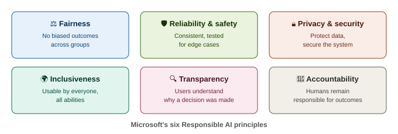
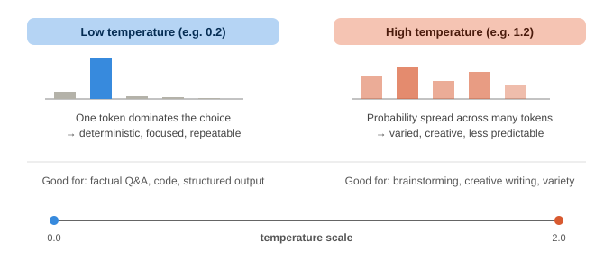
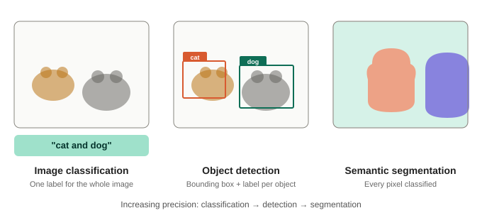
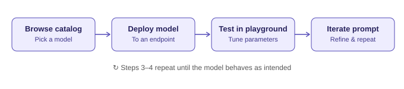
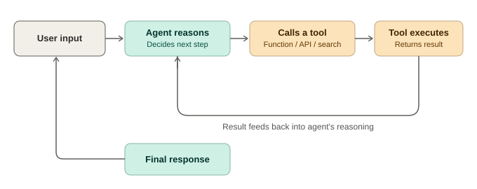
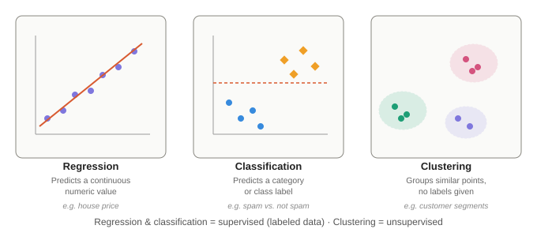

# 🧠 AI-900 & AI-901 — Microsoft Azure AI Fundamentals
### Combined Detailed Study Notes

   

> [!IMPORTANT]
> **AI-900 retired June 30, 2026** and was replaced by **AI-901** (skills as of **April 15, 2026**, per Microsoft Learn). This document covers the **current AI-901 outline in full**, plus an **AI-900 legacy appendix** for background, older resources, and interview context.

> [!TIP]
> **Key shift:** AI-900 asked you to *describe* what Azure AI services do. AI-901 asks you to *actually build* small AI apps/agents using **Microsoft Foundry** (portal + SDK). Expect "what would this code/config do" style questions, not just term definitions.

---

## 📑 Table of Contents

- [Domain Weights](#-domain-weights)
- [Domain 1: Identify AI Concepts and Capabilities (40–45%)](#-domain-1-identify-ai-concepts-and-capabilities-4045)
  - [1.1 Principles of Responsible AI](#11-principles-of-responsible-ai)
  - [1.2 AI Model Components and Configurations](#12-ai-model-components-and-configurations)
  - [1.3 Identify AI Workloads](#13-identify-ai-workloads)
- [Domain 2: Implement AI Solutions Using Microsoft Foundry (55–60%)](#-domain-2-implement-ai-solutions-by-using-microsoft-foundry-5560)
  - [2.1 Generative AI Apps and Agents](#21-implement-generative-ai-apps-and-agents-using-foundry)
  - [2.2 Text and Speech](#22-implement-ai-solutions-for-text-and-speech-using-foundry)
  - [2.3 Computer Vision and Image Generation](#23-implement-ai-solutions-with-computer-vision-and-image-generation-using-foundry)
  - [2.4 Information Extraction (Content Understanding)](#24-implement-ai-solutions-for-information-extraction-using-foundry-content-understanding)
- [Quick-Reference: Frequently Confused Concepts](#-quick-reference-frequently-confused-concepts)
- [Practice Questions (AI-901)](#-practice-questions-ai-901)
- [Exam Tips Checklist](#-exam-tips-checklist)
- [Appendix: AI-900 Legacy Material](#-appendix-ai-900-legacy-material)

---

## 📊 Domain Weights

| # | Domain | Weight |
|:-:|---|:-:|
| 1 | **Identify AI concepts and capabilities** | `40–45%` |
| 2 | **Implement AI solutions by using Microsoft Foundry** | `55–60%` |

> [!NOTE]
> Domain 2 is now the **majority** of the exam — hands-on Foundry skills matter more than pure theory.

---

## 🔷 DOMAIN 1: Identify AI Concepts and Capabilities (40–45%)

### 1.1 Principles of Responsible AI

Same six pillars as AI-900 — still foundational, appears across both domains.

| Principle | Meaning | Scenario cue |
|---|---|---|
| ⚖️ **Fairness** | AI treats all groups equitably; actively test for and mitigate bias | *"A hiring model favors one gender over another"* |
| 🛡️ **Reliability & Safety** | Consistent performance, including rare/edge cases; rigorous testing before deployment | *"A medical AI tool must be tested extensively before clinical use"* |
| 🔒 **Privacy & Security** | Protect personal data; secure the system against misuse/attack | *"Anonymizing training data"; "restricting access to model endpoints"* |
| 🌍 **Inclusiveness** | AI systems benefit and are usable by people of all abilities, backgrounds | *"App supports screen readers and multiple languages"* |
| 🔍 **Transparency** | Users understand how/why an AI reached a decision; disclose AI use | *"Providing explanations for a loan denial"; "labeling AI-generated content"* |
| 👤 **Accountability** | Humans/organizations remain responsible for AI outcomes; governance in place | *"A governance board reviews model behavior before release"* |

> [!WARNING]
> **Exam trap:** Fairness = *no biased outcomes*. Inclusiveness = *broad accessibility of the system*. Don't confuse the two.

---

### 1.2 AI Model Components and Configurations

<b>🧩 How generative AI models work</b> (click to expand)

- **Large Language Models (LLMs)** are built on the **Transformer architecture**.
- **Tokenization** — input text is broken into tokens (words or sub-words) before processing.
- **Embeddings** — tokens are converted into numeric vectors that capture semantic meaning; similar meanings → similar vectors.
- **Attention mechanism** — lets the model weigh which tokens matter most relative to each other, regardless of position in the sequence — this is what lets transformers handle long-range context well.
- **Next-token prediction** — generative models work by predicting the most probable next token given everything before it, repeated to build full responses.
- **Encoder vs. decoder:**
  - `Encoder-only` (e.g., BERT-style) → understanding/classification tasks
  - `Decoder-only` (e.g., GPT-style) → generation tasks
  - `Encoder-decoder` → transformation tasks like translation/summarization
- **Multimodal models** — accept/generate more than one content type (text + image, text + audio), e.g., GPT-4o-class models. AI-901 leans heavily on multimodal models because Foundry tasks use them for vision and speech.

<b>🎯 Choosing an appropriate model based on capabilities</b> (click to expand)

- **Task fit** — does the model support text, vision, audio, or multiple modalities?
- **Context window size** — how much input (tokens) the model can consider at once
- **Cost vs. performance tradeoffs** — smaller/cheaper models for simple tasks vs. larger models for complex reasoning
- **Latency requirements** — smaller models respond faster, useful for real-time apps
- **Specialization** — some models are tuned for code, reasoning, or specific domains
- **Licensing/openness** — proprietary (e.g., OpenAI models via Azure OpenAI) vs. open-source models available in the Foundry Model Catalog

<b>⚙️ Model deployment options and configuration parameters</b> (click to expand)

**Deployment options in Foundry:**
| Option | Best for |
|---|---|
| `Serverless API / pay-as-you-go` | No infra management, billed per use |
| `Managed compute / real-time endpoint` | Dedicated compute, more control, high-throughput/custom needs |
| `Batch deployment` | Large-scale, asynchronous, non-real-time processing |

**Key configuration parameters:**

| Parameter | Effect |
|---|---|
| `temperature` | Controls randomness — low = deterministic/focused, high = varied/creative |
| `max_tokens` | Caps the length of the generated response |
| `top_p` (nucleus sampling) | Limits token choices to a cumulative probability mass — controls diversity |
| `frequency_penalty` / `presence_penalty` | Reduce repetition in output |
| `stop` sequences | Strings that tell the model to stop generating |

---

### 1.3 Identify AI Workloads

**Common AI workload categories:**

- 🤖 **Generative AI** — creating new text, images, audio, or code
- 🕹️ **Agentic AI** — systems (**agents**) that autonomously plan, use tools/functions, and take multi-step actions toward a goal — *new emphasis vs. AI-900*
- 📝 **Text analysis** — extracting insight from written text
- 🎙️ **Speech** — recognizing and synthesizing spoken language
- 👁️ **Computer vision** — extracting information from images/video
- 📄 **Information extraction** — pulling structured data out of unstructured sources, powered in Foundry by **Content Understanding**

#### 1.3.1 Text Analysis Techniques

| Technique | Description |
|---|---|
| **Keyword / key phrase extraction** | Identifies the most important words/phrases representing the main points of text |
| **Entity detection (NER)** | Identifies and categorizes named entities — people, organizations, locations, dates, quantities |
| **Sentiment analysis** | Classifies text as positive, negative, neutral, or mixed, with confidence scores |
| **Summarization** | Condenses text — **extractive** (existing sentences) vs. **abstractive** (new, paraphrased) |

#### 1.3.2 Speech Recognition and Synthesis

- **Speech recognition (speech-to-text)** — converts spoken audio into text; real-time (streaming) or batch (pre-recorded)
- **Speech synthesis (text-to-speech)** — converts text into natural spoken audio; prebuilt or custom neural voices
- **Speech translation** — real-time translation of spoken input into another language (text or speech output)
- ✨ **Responding to spoken prompts using a deployed multimodal model** — some models take audio input directly, skipping the separate speech-to-text step

#### 1.3.3 Computer Vision and Image-Generation Models

| Capability | Description |
|---|---|
| **Image classification** | Assigns one label to a whole image |
| **Object detection** | Detects multiple objects, draws bounding boxes with labels |
| **Semantic segmentation** | Classifies every pixel into a category — most granular |
| **OCR** | Extracts printed/handwritten text from images |
| **Facial detection/analysis** | Locates faces and extracts attributes ⚠️ *subject to Responsible AI restrictions* |
| **Image generation** | Generative models (DALL·E-class, diffusion) create new images from text prompts |
| **Multimodal vision models** | Interpret an image + text prompt together (visual Q&A, image captioning) |

#### 1.3.4 Extracting Information from Text, Images, Audio, and Video

Ties directly to **Azure AI Content Understanding** (core Foundry Tools capability, new to this exam):

- Extracts **structured data** from **unstructured** multimodal content
- Works across **documents/forms**, **images**, **audio**, and **video**
- Typical outputs: key-value fields, tables, entities, timestamps/transcripts, classifications
- Distinct from simple OCR — applies schemas/templates across modalities to extract exactly the fields you define

---

## 🔶 DOMAIN 2: Implement AI Solutions by Using Microsoft Foundry (55–60%)

**Microsoft Foundry** (successor branding to Azure AI Studio / Azure AI Foundry) is the unified platform for building, testing, and deploying generative AI apps and agents. This domain tests whether you know the *workflow* of building with it, not just what it is.

### 2.1 Implement Generative AI Apps and Agents Using Foundry

**Prompt engineering — system and user prompts**

- **System prompt/message** — sets the model's role, tone, constraints, and behavior for the whole session
  > *e.g. "You are a helpful customer support agent for a software company. Only answer questions about billing."*
- **User prompt** — the actual end-user input/question
- **Effective prompting techniques:**
  - [x] Be specific and give context
  - [x] Use **few-shot examples** (sample input/output pairs) to guide format
  - [x] Break complex tasks into steps (**chain-of-thought style prompting**)
  - [x] Define output format explicitly (e.g., "respond in JSON with fields X and Y")
  - [x] Use **grounding** — supply relevant data so answers are fact-based, reducing **hallucination**

**Deploying and interacting with a model in the Foundry portal** — typical workflow:

1. Browse the **Model Catalog** (Microsoft, OpenAI, Meta, Mistral, and other providers)
2. **Deploy** to an endpoint (serverless/pay-as-you-go vs. managed compute)
3. Use the **chat playground** to test prompts and tune parameters
4. Review responses, adjust the system prompt, iterate

**Building a lightweight chat client with the Foundry SDK**

- The **Foundry SDK** calls deployed models from your own code (Python emphasized)
- Minimal chat client flow: authenticate → send system + user message → receive/display response → loop for multi-turn, appending prior turns
- ⚠️ Conversation history must be **resent each turn** — the API is stateless by default (unless using a "threads"/session feature)

**Creating and testing a single-agent solution in the Foundry portal**

> An **agent** = a model configured with **instructions**, plus optionally **tools/functions** it can call and/or **knowledge sources** it can retrieve from.

Building an agent typically involves:
1. Defining the agent's instructions (persona + task)
2. Attaching **tools** (function calling) for actions beyond text generation
3. Optionally attaching a **knowledge source** for grounding
4. Testing in a chat/playground interface

> [!TIP]
> **Agentic AI** = the model doesn't just answer — it decides *which* tool to call and *when*, sometimes chaining multiple steps to reach a goal.

**Building a lightweight client application for an agent**

The client must also handle **tool-call events**:

---

### 2.2 Implement AI Solutions for Text and Speech Using Foundry

| Scenario | What it involves |
|---|---|
| **Text analysis app** | Lightweight app calling a Foundry-deployed model / Language service for key phrase extraction, sentiment, entities, or summarization |
| **Spoken prompts via multimodal model** | Feed **audio directly** to a multimodal model — no manual transcription step needed |
| **Azure Speech in Foundry Tools** | Build with speech-to-text, text-to-speech, translation inside the Foundry ecosystem (e.g., a voice assistant loop) |

---

### 2.3 Implement AI Solutions with Computer Vision and Image-Generation Using Foundry

| Scenario | What it involves |
|---|---|
| **Interpreting visual input** | Pass an image + text prompt to a multimodal model for description/analysis (visual Q&A, captioning) |
| **Creating new visual outputs** | Use an image-generation model to produce images from text prompts; tune prompt wording, size, style |
| **Lightweight vision app** | User uploads image and/or prompt → app sends to model → displays text or image response |

---

### 2.4 Implement AI Solutions for Information Extraction Using Foundry (Content Understanding)

**Azure AI Content Understanding** is a major new focus area. Know these four scenarios:

| Source | What Content Understanding does |
|---|---|
| 📄 **Documents and forms** | Extracts structured fields (key-value pairs, tables, line items) from invoices, receipts, contracts using a defined schema |
| 🖼️ **Images** | Extracts structured info from image content (labels, photographed forms, visual classification) |
| 🎧 **Audio and video** | Extracts transcripts, speaker info, key moments/timestamps, summaries |
| 🛠️ **Building an app** | Client submits a file to a Content Understanding analyzer, displays structured output + confidence scores |

> [!WARNING]
> **Exam trap:** Content Understanding is broader than OCR — OCR only reads text; Content Understanding applies a schema across modalities to output structured, labeled data (e.g., "Invoice Number," "Total Due," "Vendor Name" as distinct fields) across documents, images, audio, **and** video.

---

## 🧭 Quick-Reference: Frequently Confused Concepts

| A | vs. | B | The Difference |
|---|:-:|---|---|
| **Fairness** | ⚡ | **Inclusiveness** | No biased outcomes vs. broad system accessibility |
| **OCR** | ⚡ | **Content Understanding** | Reads raw text vs. extracts structured, schema-based fields across modalities |
| **Agent** | ⚡ | **Basic chat call** | Invokes tools/multi-step actions vs. just returns text |
| **System prompt** | ⚡ | **User prompt** | Persistent behavior/role vs. the specific ask this turn |
| **Grounding** | ⚡ | **Fine-tuning** | Live/relevant data at inference time vs. retraining model weights |
| **Serverless deployment** | ⚡ | **Managed compute** | No infra to manage vs. dedicated compute you provision |
| **Temperature (low)** | ⚡ | **Temperature (high)** | Deterministic/focused vs. random/creative |
| **Speech-to-text (separate step)** | ⚡ | **Multimodal audio input** | Transcribe-then-send vs. model consumes audio directly |

---

## ✅ Practice Questions (AI-901)

<b>Q1.</b> A company wants its AI chatbot to explain <i>why</i> it denied a customer's request, in plain language. Which Responsible AI principle applies?

A) Inclusiveness&nbsp;&nbsp;B) Transparency&nbsp;&nbsp;C) Accountability&nbsp;&nbsp;D) Fairness

**Answer: B — Transparency** (explaining decisions to users)

<b>Q2.</b> You want output to be highly consistent and deterministic across repeated runs with the same prompt. Which parameter should you set low?

A) Max tokens&nbsp;&nbsp;B) Top P&nbsp;&nbsp;C) Temperature&nbsp;&nbsp;D) Frequency penalty

**Answer: C — Temperature** (low = deterministic)

<b>Q3.</b> Which best describes an "agent" in Microsoft Foundry?

A) A model that only classifies text into fixed categories
B) A model configured with instructions and the ability to invoke tools/functions to take multi-step actions
C) A synonym for any deployed generative model
D) A dataset used to fine-tune a model

**Answer: B** — Agent = instructions + tool use for multi-step actions

<b>Q4.</b> A retailer wants to extract vendor name, invoice number, and total from thousands of scanned invoices in different layouts. Best Foundry capability?

A) Azure AI Content Understanding&nbsp;&nbsp;B) Sentiment analysis&nbsp;&nbsp;C) Semantic segmentation&nbsp;&nbsp;D) Speech synthesis

**Answer: A** — Content Understanding handles structured extraction across varied layouts

<b>Q5.</b> What is the primary purpose of "grounding" a generative AI model's responses?

A) To make responses shorter
B) To reduce the model's computational cost
C) To supply relevant, up-to-date data so answers are based on facts, reducing hallucination
D) To convert text input into embeddings

**Answer: C**

<b>Q6.</b> Which deployment option suits a low-traffic prototype where you don't want to manage any infrastructure?

A) Managed compute / real-time endpoint&nbsp;&nbsp;B) Batch deployment&nbsp;&nbsp;C) Serverless / pay-as-you-go&nbsp;&nbsp;D) On-premises

**Answer: C** — Serverless/pay-as-you-go = no infrastructure management

<b>Q7.</b> A developer wants their chat client to maintain context across multiple turns using the Foundry SDK. What must the client do?

A) Nothing — the API automatically remembers all prior turns
B) Resend the full relevant conversation history with each new request, since the API is stateless by default
C) Only send the very first message each time
D) Use a separate model for each turn

**Answer: B**

<b>Q8.</b> Which technique would identify that a paragraph mentions "Microsoft," "Seattle," and "March 2026" as distinct categorized items?

A) Sentiment analysis&nbsp;&nbsp;B) Entity detection (NER)&nbsp;&nbsp;C) Summarization&nbsp;&nbsp;D) Keyword extraction

**Answer: B** — Entity detection identifies/categorizes named entities like organizations, places, dates

<b>Q9.</b> A team wants a multimodal model to directly answer a spoken question from an audio clip, without a separate transcription step. What enables this?

A) Semantic segmentation&nbsp;&nbsp;B) A multimodal model accepting audio input directly&nbsp;&nbsp;C) Object detection&nbsp;&nbsp;D) Batch deployment

**Answer: B**

<b>Q10.</b> What distinguishes abstractive summarization from extractive summarization?

A) Abstractive picks existing sentences verbatim; extractive generates new paraphrased text
B) Extractive picks existing sentences verbatim; abstractive generates new paraphrased text
C) They are the same technique with different names
D) Abstractive only works on images

**Answer: B**

<b>Q11.</b> Which Responsible AI principle is most directly addressed by extensive edge-case testing of a self-driving car's AI before deployment?

A) Transparency&nbsp;&nbsp;B) Reliability and Safety&nbsp;&nbsp;C) Inclusiveness&nbsp;&nbsp;D) Privacy and Security

**Answer: B**

<b>Q12.</b> In the Foundry Model Catalog, why might you choose a smaller model over a larger one for a specific task?

A) Smaller models are always more accurate
B) Smaller models typically offer lower latency and lower cost for simpler tasks
C) Smaller models support more modalities
D) Smaller models cannot be deployed via Foundry

**Answer: B**

---

## 📋 Exam Tips Checklist

- [ ] Review the **actual steps** of the Foundry portal/SDK workflow — this exam tests reasoning about workflows, not just definitions
- [ ] Recognize a simple Python API call to send a prompt / receive a response (basic Python literacy assumed)
- [ ] Spend extra time on **Agentic AI** and **Content Understanding** — the biggest new areas vs. AI-900
- [ ] Don't discard old AI-900 material on Azure AI Vision/Language etc. — Domain 1 overlaps heavily, just accessed via Foundry now
- [ ] Take the free official practice assessment on **AI Skills Navigator** before the real exam

---

## 📦 Appendix: AI-900 (Legacy) Material

> [!NOTE]
> AI-901 no longer tests these as separate exam sub-skills, but this content is useful background — the classic ML foundations and service-by-service breakdown that AI-901 assumes you've internalized. Worth knowing for older resources, interviews, or the fuller conceptual picture.

<b>A.1 — Machine Learning Fundamentals (AI-900 Domain, 15–20%)</b>

**Core ML Techniques**

- **Regression** — predicts a **continuous numeric value** (e.g., house price, temperature)
- **Classification** — predicts a **category/class label** (e.g., spam vs. not spam); binary (2 classes) or multiclass (3+)
- **Clustering** — groups similar data points **without labeled outcomes** (unsupervised), e.g., customer segmentation

> **Key distinction:** Regression/Classification = **supervised learning**. Clustering = **unsupervised learning**.

**Deep Learning & Transformer Architecture**
- **Deep learning** — multi-layered **neural networks**; needs large data/compute (often GPUs)
- **Neural network basics:** input layer → hidden layer(s) → output layer; weighted nodes adjusted via training
- **Transformer architecture** (still directly relevant to AI-901 Domain 1.2):
  - **Attention mechanism** — weighs token importance regardless of position
  - **Encoder** — builds a representation of input
  - **Decoder** — generates output from that representation
  - Encoder-only (BERT-style), decoder-only (GPT-style), encoder-decoder (translation-style)

**Core ML Concepts**
| Term | Meaning |
|---|---|
| **Features** | Input variables used to make predictions |
| **Labels** | The known output being predicted (supervised learning only) |
| **Training dataset** | Data used to teach/fit the model |
| **Validation dataset** | Data used to tune the model and check against overfitting |

**Azure Machine Learning (classic) Capabilities**
- **Automated ML (AutoML)** — automatically tries algorithms/hyperparameters for the best model
- **Azure ML Designer** — drag-and-drop, no-code/low-code pipeline builder
- **Compute options:** Compute Instances (dev workstation), Compute Clusters (scalable training, autoscale to 0), Inference Clusters (AKS-based deployment), Attached Compute (external resources)
- **Datastores** — connections to Blob Storage, Data Lake, etc.
- **Model management:** register in a model registry; deploy as **real-time endpoint** or **batch endpoint**
- **Responsible AI dashboard** — fairness, explainability, error analysis tooling

<b>A.2 — Computer Vision Workloads: Classic Service Breakdown (AI-900 Domain, 15–20%)</b>

| Solution | What it does |
|---|---|
| **Image classification** | Assigns a label/category to an entire image |
| **Object detection** | Identifies multiple objects, draws **bounding boxes** with labels |
| **Semantic segmentation** | Classifies every pixel into a category — most granular |
| **OCR** | Extracts printed or handwritten text from images/documents |
| **Facial detection** | Locates human faces (bounding box) |
| **Facial analysis** | Extracts attributes (age estimate, emotion, head pose) — Responsible AI restricted |

> [!WARNING]
> **Trap:** Object detection = bounding box + label per object. Image classification = ONE label for the whole image. Segmentation = pixel-level, most precise.

**Classic Azure Tools/Services**
- **Azure AI Vision** (formerly Computer Vision) — image analysis, OCR/Read API, spatial analysis
- **Azure AI Custom Vision** — train your **own custom** classifier/detector on your own labeled images
- **Azure AI Face service** — face detection, verification, analysis; strict Responsible AI gating

<b>A.3 — NLP Workloads: Classic Service Breakdown (AI-900 Domain, 15–20%)</b>

| Task | Description |
|---|---|
| **Key phrase extraction** | Pulls out main talking points/phrases |
| **Entity recognition (NER)** | Identifies/categorizes entities — people, places, orgs, dates, quantities |
| **Sentiment analysis** | Positive/negative/neutral/mixed, with confidence scores |
| **Language detection** | Identifies which language text is written in |
| **Language modeling** | Predicting/generating likely word sequences |
| **Speech recognition (STT)** | Converts spoken audio to text |
| **Speech synthesis (TTS)** | Converts text to natural spoken audio |
| **Translation** | Converts text/speech between languages |

**Classic Azure Tools/Services**
- **Azure AI Language** — key phrase extraction, entity recognition, sentiment, language detection; **CLU** for custom chatbot NLU; **Question Answering** for FAQ-style knowledge bases; extractive/abstractive summarization
- **Azure AI Speech** — STT, TTS, **Speech Translation**, speaker recognition
- **Azure AI Translator** — dedicated text translation (distinct from Speech Translation)

> [!WARNING]
> **Trap:** Azure AI Language (text-based NLP) vs. Azure AI Translator (dedicated text translation) vs. Azure AI Speech (audio in/out).

<b>A.4 — Generative AI Workloads: AI-900's Original Framing (20–25%)</b>

AI-900's final version (May 2025 update) already introduced generative AI before AI-901 expanded it into the dominant, hands-on Domain 2:

- **Azure AI Foundry** (formerly Azure AI Studio) — unified platform to explore, build, test, deploy generative AI apps/agents; includes the **Model catalog**
- **Azure OpenAI Service** — Azure-hosted OpenAI models (GPT family, embeddings, DALL·E) with enterprise security/compliance; built-in content filtering; fine-tuning and grounding support
- **Prompt engineering, grounding, hallucination** — same core concepts still tested in AI-901

> [!WARNING]
> **Trap:** Azure AI Foundry = the overall platform. Azure OpenAI Service = specifically OpenAI's models hosted on Azure. Model Catalog = the model-browsing feature inside Foundry.

<b>A.5 — AI-900 Quick-Reference: Frequently Confused Pairs</b>

- **Classification vs. Clustering** — labeled/supervised vs. unlabeled/unsupervised
- **Object Detection vs. Semantic Segmentation** — bounding boxes vs. pixel-level classification
- **Azure AI Language vs. Azure AI Translator** — general NLP tasks vs. dedicated translation
- **Azure AI Vision vs. Azure AI Custom Vision** — pre-built general model vs. train-your-own custom model
- **Training dataset vs. Validation dataset** — fit the model vs. tune/check the model

<b>A.6 — AI-900 Legacy Practice Questions</b>

**Q1.** A dataset has no labeled outcomes, and the goal is to group similar customers together. Which ML technique applies?
A) Regression&nbsp;&nbsp;B) Classification&nbsp;&nbsp;C) Clustering&nbsp;&nbsp;D) Object detection
**Answer: C**

**Q2.** Which computer vision solution draws a bounding box around each detected item and labels it?
A) Image classification&nbsp;&nbsp;B) Object detection&nbsp;&nbsp;C) Semantic segmentation&nbsp;&nbsp;D) OCR
**Answer: B**

**Q3.** Which Azure service trains your own custom image classifier using your own labeled photos?
A) Azure AI Vision&nbsp;&nbsp;B) Azure AI Custom Vision&nbsp;&nbsp;C) Azure AI Face&nbsp;&nbsp;D) Azure ML Designer
**Answer: B**

**Q4.** What is the difference between a training dataset and a validation dataset?
A) They are the same thing
B) Training data fits the model; validation data tunes/checks it before final evaluation
C) Validation data is only used for clustering
D) Training data is always unlabeled
**Answer: B**

**Q5.** Which Azure AI Language feature would identify that a support ticket is expressing frustration?
A) Key phrase extraction&nbsp;&nbsp;B) Sentiment analysis&nbsp;&nbsp;C) Language detection&nbsp;&nbsp;D) Entity recognition
**Answer: B**

---

**Good luck! 🎓** — Study the concepts, run through the practice questions until the answers feel obvious, and take the official practice assessment before exam day.

